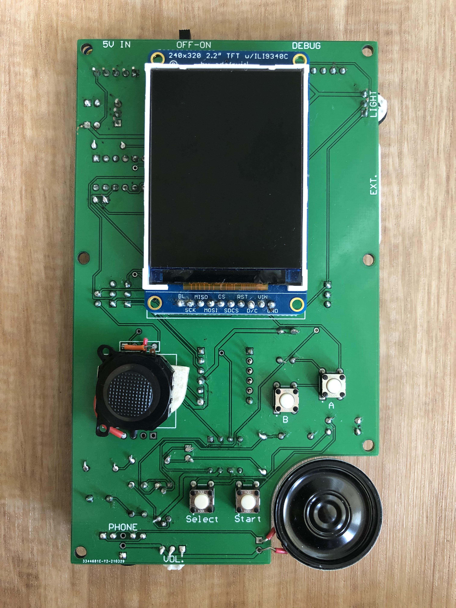
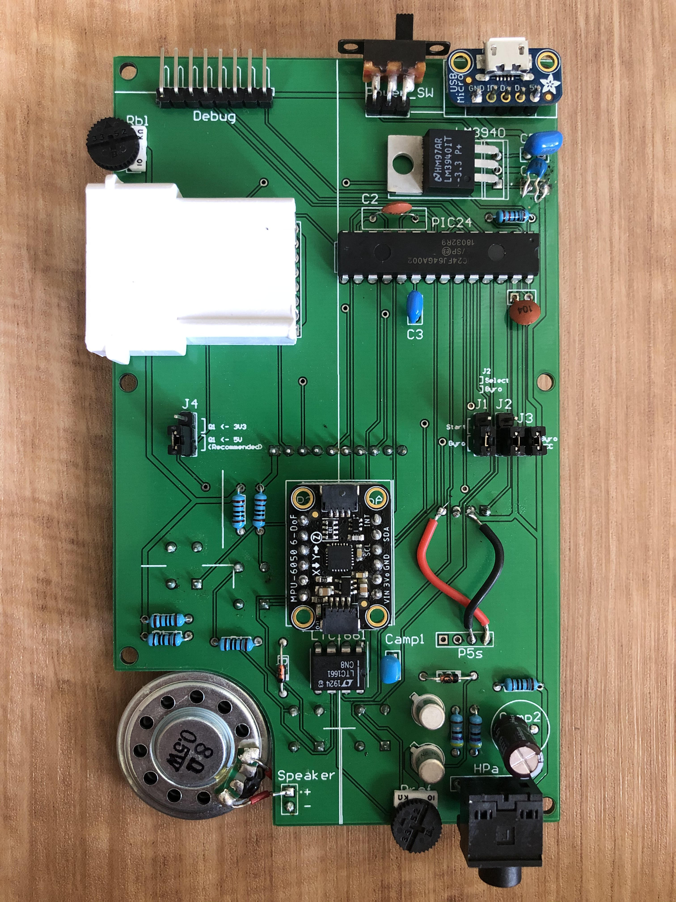
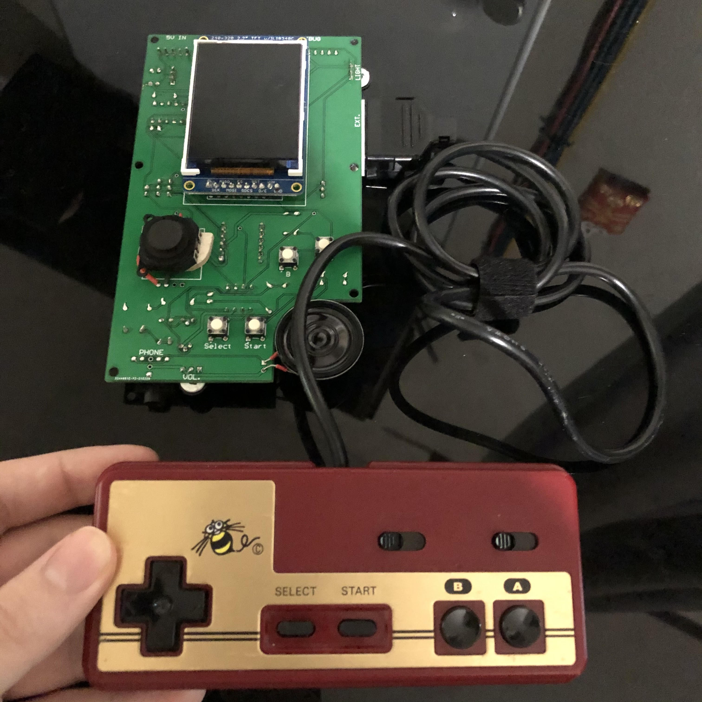

# Senior Design Project (Spring 2021)

My Senior Design project from Spring 2021 where I made a handheld game console from scratch (coded in C for a PIC24 microprocessor) in about 8 weeks.
I programmed the microcontroller as well as designed and populated the PCB myself. I did borrow from one Adafruit graphics library for LCD writing which I ported over from C++ to C for the PIC24. I made a simple avoid-the-enemies game as a demo built into the custom 'operating system'.
Please see the included [FinalDesignReport.pdf](https://github.com/ericdigioia/Senior-Design-Project/blob/main/FinalDesignReport.pdf) for all technical and design information.

